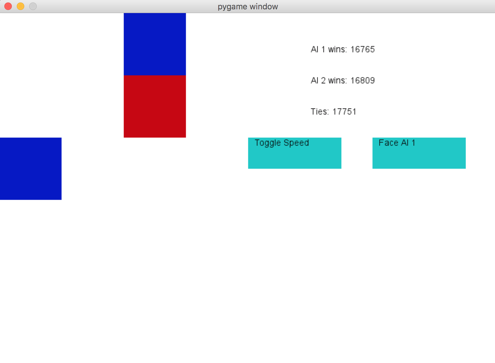
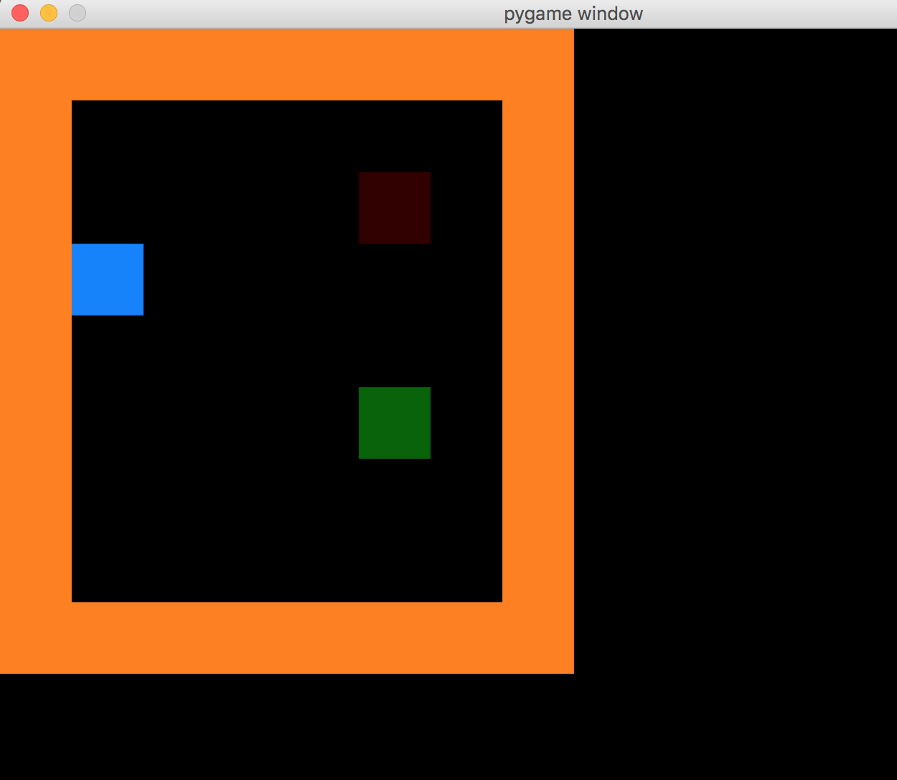

# Fun with simple Q learning

I've always thought that reinforcement learning was really cool.  This repository contains a Python implementation of simple Q learning to teach an AI how to play tic tac toe, or run a maze.  I tried to use it on Dots and Boxes but the state space is so big (or perhaps the strategy to be learned is random?) that the AI produced wasn't very good at the game.
  
For a Javascript and web-viewable version, see here: http://thatnerd2.github.io/projects/rat-reward-js/index.html
  
To run, download/clone this repository and navigate to a folder and execute the python file that looks executable.  If it works, it'll bring up a pygame window.
  
## Tic Tac Toe

## Rat in a cage

